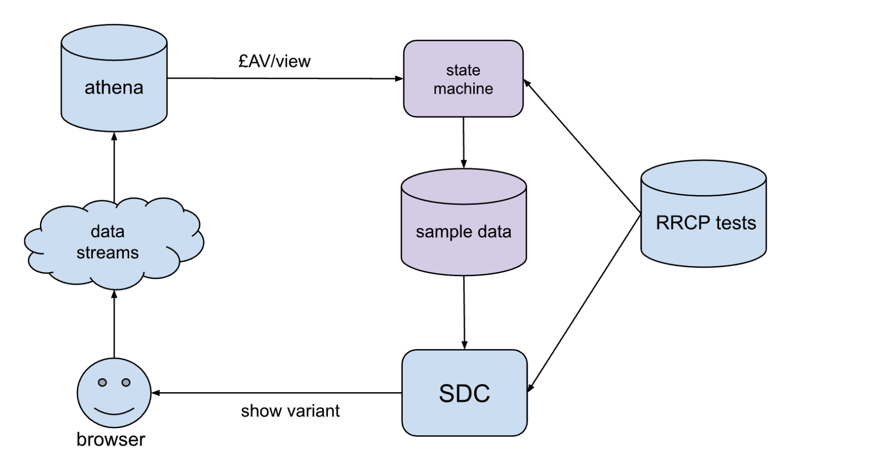
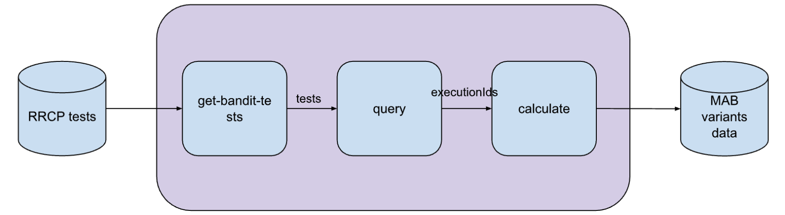

## support-bandit

Defines two lambdas, `get-bandit-tests` and `query-lambda`, that form a state machine (using Step Functions) to record view and acquisition data for [multi-armed bandit](https://vwo.com/blog/multi-armed-bandit-algorithm/) experiments. RRCP channel tests (Epics + Banners) that are marked as bandit experiments will be picked up and their performance data written to a DynamoDB table. The state machine is scheduled to run once an hour.

Diagram showing how this state machine (shown here as "bandit sampling") fits into the existing architecture.
The multi-armed bandit decision-making happens in SDC.

### get-bandit-tests

The first lambda in the state machine is `get-bandit-tests`. It queries the DynamoDB table `support-admin-console-channel-tests-` for Epic and Banner tests that have a multi-armed bandit methodology in their `methodologies` field. It returns a list of these tests as its output.

### query-lambda

The next lambda, `query-lambda`, takes the tests from `get-bandit-tests` as its input. It queries the BigQuery tables `fact_page_view_anonymised` and `fact_acquisition_event` to get the views and acquisitions in GBP per variant per test. It uses the hour prior to the lambda execution as its date range.

It writes this data to a DynamoDB table `support-bandit-`. The data recorded consists of a test name (prefixed with the channel), timestamp and an array of performance data per variant.

Diagram showing the architecture of this state machine.
