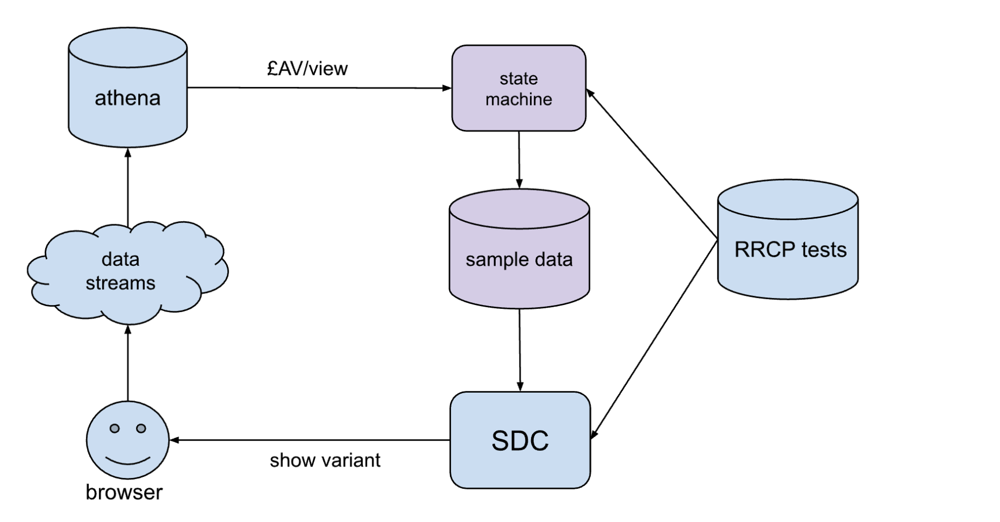
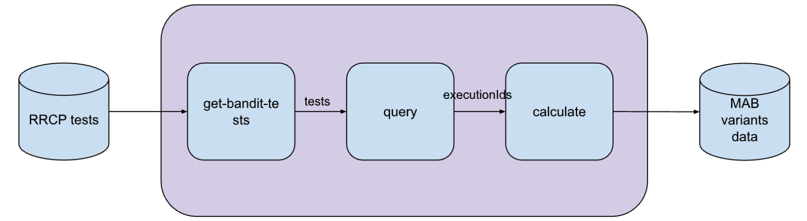

## support-bandit

Defines two lambdas, `get-bandit-tests` and `query-lambda`, that form a state machine (using Step Functions) to record view and acquisition data for [multi-armed bandit](https://vwo.com/blog/multi-armed-bandit-algorithm/) experiments. RRCP channel tests (Epics + Banners) that are marked as bandit experiments will be picked up and their performance data written to a DynamoDB table. The state machine is scheduled to run once an hour.


Diagram showing how this state machine (shown here as "bandit sampling") fits into the existing architecture.
The multi-armed bandit decision-making happens in SDC. (Original [here](https://docs.google.com/drawings/d/18FQDS9bT2ciTur-OHoaWfw6vMFxP3Zf-pz8_GCwM8FE))

### get-bandit-tests

The first lambda in the state machine is `get-bandit-tests`. It queries the DynamoDB table `support-admin-console-channel-tests-{stage}` for tests across four channels (`Epic`, `Banner1`, `Banner2`, and `SupportLandingPage`) that have a multi-armed bandit methodology in their `methodologies` field. It returns a list of these tests as its output.

### query-lambda

The next lambda, `query-lambda`, takes the tests from `get-bandit-tests` as its input. It queries the BigQuery tables `fact_page_view_anonymised` and `fact_acquisition_event` to get the views and acquisitions in GBP per variant per test. It uses the hour prior to the lambda execution as its date range.

It writes this data to a DynamoDB table `support-bandit-`. The data recorded consists of a test name (prefixed with the channel), timestamp and an array of performance data per variant.

#### Landing Page Support

The system supports bandit sampling for landing pages using the `ab_test_array` column instead of `component_event_array`. Landing pages are identified by the `SupportLandingPage` channel:

- **SupportLandingPage**: Uses `host = 'support.theguardian.com'` AND `path LIKE '%/contribute'`

Landing page tests are detected by channel type (`SupportLandingPage`). For these tests, the system queries `ab_test_array` with fields `ab_test_name` and `ab_test_variant`, rather than the component-based approach.

The system queries four channels: `Epic`, `Banner1`, `Banner2`, and `SupportLandingPage` from the DynamoDB `support-admin-console-channel-tests-{stage}` table.


Diagram showing the architecture of this state machine.

### Running the state machine manually
You can manually run the state machine from the AWS Step Functions console page.

This is useful for testing in CODE, and also for backfilling data in PROD if there has been an outage that caused the state machine to fail.

In the console click "Start execution".

To query the most recent hour of data, leave the input field empty.

To query for a specific hour (i.e. if you're backfilling a failed run), enter an object with a timestamp, e.g.:
```
{
  "timestamp": "2026-05-01T09:00:00"
}
```
This will cause the query-lambda to query for the period 2026-05-01T07:00:00 to 2026-05-01T08:00:00, because it looks back at the hour before last.

The Step functions console will indicate if the state machine succeeded or not. You can also click through to the lambda logs for more details, e.g. the query-lambda logs contain the queries that were sent to BigQuery.
