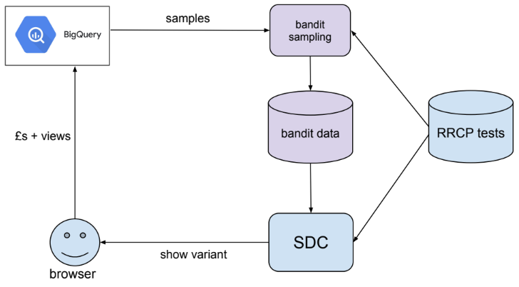
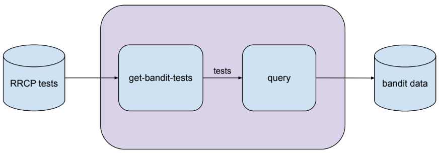

## support-bandit

Defines three lambdas `get-bandit-tests`, `query-lambda` and `calculate-lambda` that form a state machine (using Step Functions) to record view and acquisition data for multi-armed bandit experiments. RRCP channel tests (only Epics for now) that are marked as bandit experiments will be picked up and their performance data written to a DynamoDB table. The state machine is scheduled to run once an hour.

Diagram showing how this state machine fits into the existing architecture.

### get-bandit-tests

The first lambda in the state machine is `get-bandit-tests`. It queries the DynamoDB table `support-admin-console-channel-tests-` for Epic tests with the property `isBanditTest: true`. It returns a list of these tests as its output.

### query-lambda

The next lambda, `query-lambda`, takes the tests from `get-bandit-tests` as its input. It queries the Athena tables `acquisition.epic_views_` and `acquisition.acquisition_events_` to get the views and acquisitions in GBP per variant per test. It uses the hour prior to the lambda execution as its date range. As its output it returns an array of query execution IDs.

This lambda has a dependency on the `super-mode-calculator` to create the partitions necessary to query the Athena data. To avoid the partition and data not being ready, the hourly schedule is offset by 15 minutes past the hour.

### calculate-lambda

The final lambda in the state machine, `calculate-lambda`, takes the array of query execution IDs as its input. It polls Athena to check if the queries have finished executing, and the state machine retries this step if not. Once the data is returned it is written to a DynamoDB table `support-bandit-`. The data recorded consists of a test name, timestamp and an array of performance data per variant.

Diagram showing the architecture of this state machine.
